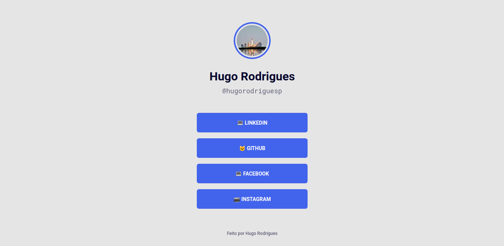
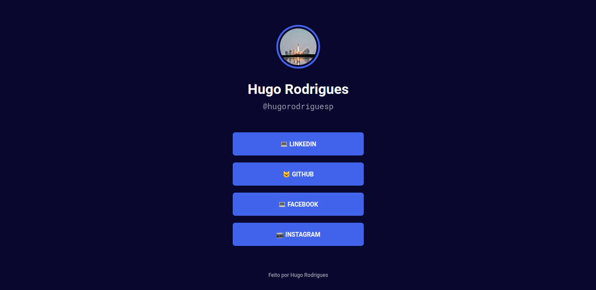
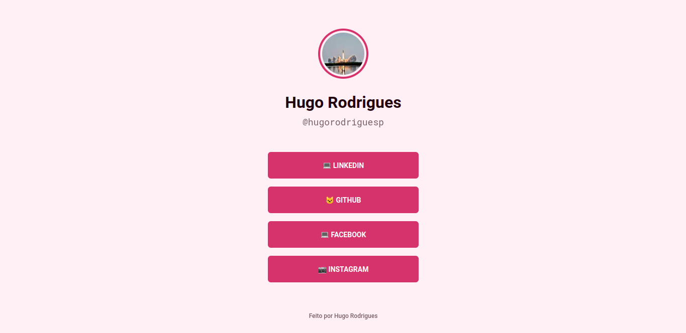
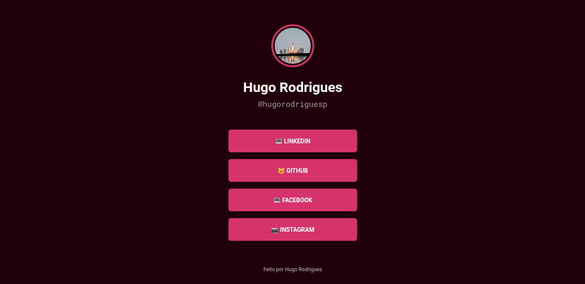

# Rocket-Links

## Descrição
Projeto desenvolvido na **Maratona Explorer 2.0**. Nesse projeto criamos um "Amplificador de links" para a Bio do Instagram.

## Modificando os temas
Para modificar os temas do projeto mude a propriedade **class** no **body** da pagina **index.html** para uma dos valores abaixo:

- vazio (PADRÃO)
- dark-blue
- pink
- dark-pink

----
## Temas

### Blue light (Padrão)

### Blue Dark

### Pink

### Pink Dark

## Tecnologias usadas
- HTML5
- CSS3
- JS (JavaScript)

## Criador
__Criado por: Hugo Rodrigues Pereira__
	